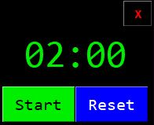
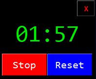
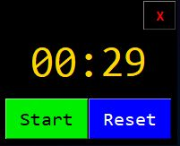
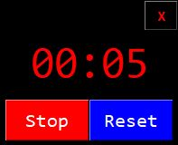

# Countdown

A simple countdown widget for the windows desktop developed in Python and 
Tkinter.

## Functionality

Developed as a simple 2-minute timer for stand-up meetings, the Countdown timer is frameless, and always displayed 
on top of any windows. It can be configured to display in any corner of the screen e.g.
* top-left
* top-right
* bottom-left
* bottom-right

It will be displayed above the task bar, if there is one.

Although the default is for 2-minutes, it can be configured for any countdown time up to 99-minutes and 59-seconds.

It can also be configured to display on any available monitors/displays, if there is more than one, but by default is shown on the top-left of the first monitor. 




The 'start' button is modal. Once the countdown is started it changes to a 'Stop' button.



At 30-seconds the timer changes colour to Amber/Orange.



And at 10-seconds it changes to red.



The 'Reset' button will stop the timer, if running, and reset to the original count down time.

On reaching 00:00, the digits will flash and the 'countdown_alarm.wav' file will be played as audio.
The 'countdown_alarm.wav' file has to be in the same directory as the 'countdown.py' script. Currently,
it's a klaxon sound. 

## Command Line
```
: python countdown.py --help
usage: countdown.py [-h] [-d [DISPLAY]] [-m [MINUTES]] [-s [SECONDS]] [-p [POSITION]]

optional arguments:
  -h, --help            show this help message and exit
  -d [DISPLAY], --display [DISPLAY]
                        The screen/monitor to display on, the default is 1.
  -m [MINUTES], --minutes [MINUTES]
                        Count down minutes, range is 0..99, default is 2.
  -s [SECONDS], --seconds [SECONDS]
                        Count down seconds, range is 0..59, default is 0.
  -p [POSITION], --position [POSITION]
                        Position on screen for the timer, options are: tl (top left - default), tr
                        (top right), bl (bottom left), br (bottom right)
```

